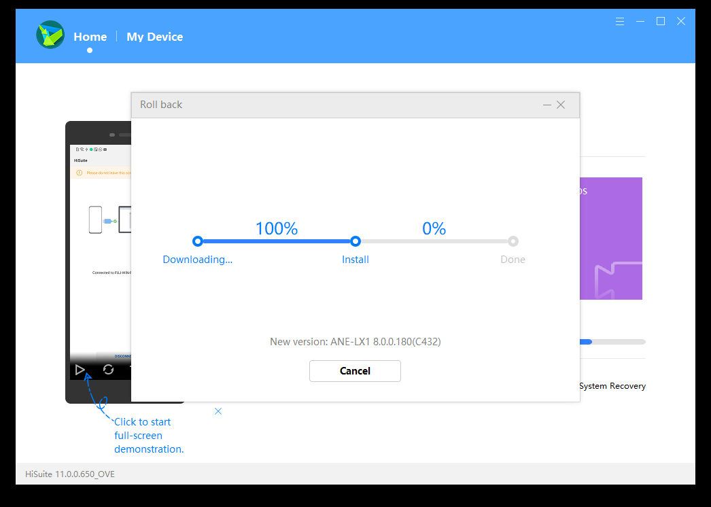
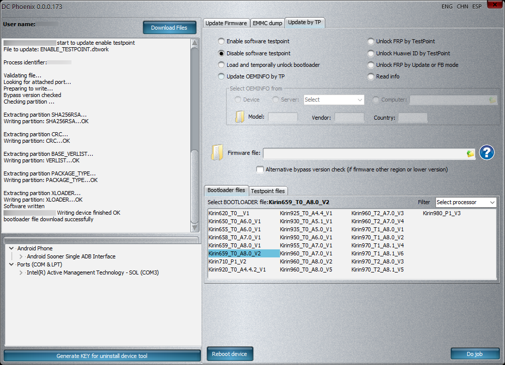

# Unlocking Bootloader for Huawei ANE-LX1 / P20 Lite
This write-up protocols the steps I made in order to unlock my Huawei ANE-LX1's bootloader. The paid tools DC-Unlocker and HCU Client were used, which yields the benefit that the ANE-LX1 didn't have to be physically opened. An alternative method which requires opening the ANE-LX1 but doesn't require paid tools is [mashed-potatoes/PotatoNV](https://github.com/mashed-potatoes/PotatoNV).

Make sure that ADB and fastboot are available.

Some tools required cannot be run in Wine or a Windows Virtual Machine. Therefore, I ran DC-Unlocker and HCU Client on a PC running Windows but performed all tasks relying on ADB or fastboot on another PC running GNU/Linux.

> [!WARNING]  
> I strongly recommend, that you first read all steps before starting.
>
> Unlocking your bootloader might be irreversible and/or brick your ANE-LX1.

---

1. Backup data
	1. Backup all data on your ANE-LX1 including data on the memory card (if you've inserted one) and either upload your backup to some cloud drive or copy it onto another device.
	2. Verify on PC that your backup is not corrupted.
2. Downgrade your ANE-LX1 to EMUI 8, if you're running EMUI 9
	1. Connect PC with ANE-LX1 using a USB A ↔ USB C cable
	2. On PC, install HiSuite
	3. On PC, run HiSuite
		1. *Optional: I suggest disabling auto start for HiSuite as it can be quite annoying. For this, open HiSuite's settings, uncheck “Start upon connection to your device” and click “OK”* 
			
	4. On PC, confirm installing Huawei HiSuite on ANE-LX1 
		
	5. On ANE-LX1, confirm permissions for HiSuite
	6. On PC, enter 8-digit verification code displayed on ANE-LX1 
		
	7. HiSuite is now connected to your ANE-LX1 
		
	8. On PC, select “Update”
	9. On PC, click on “Switch to Other Version>” 
		
	10. On PC, click on “Earlier Versions”
		1. You should be presented the option to downgrade to ANE-LX1 8.0.0.180(C432)(Official)
	11. On PC, click on “Restore” 
		
	12. On PC, click on “Roll back” 
		
	13. On PC, click on “Agree”
		* ⚠️ This will delete all data from your ANE-LX1 
		1. 
		2. HiSuite will now download the firmware which it is about to flash onto the ANE-LX1. This process will take a few minutes. If the progressbar is stuck at 99 % notably longer than it needed for previous 1-%-increments then click on “Cancel” and restart the process. 
			
		3. Afterwards it will install the firmware 
			
	14. On PC, click on “OK” 
		
	15. The downgrade will commence on your ANE-LX1
	16. Await the “Factory reset lowlevel…”
3. Configure your device
	* ℹ️ You can probably skip “Configure your device” and “Setup ADB” by just booting into fastboot mode, i.e. holding <kbd>Vol-</kbd> and <kbd>Power</kbd> while your ANE-LX1 is connected to your PC via USB and proceeding with “Purchase DC-Unlocker / HCU Client”. I didn't test that, though
	1. Select a language and tap “NEXT >” 
		
	2. Tap “SKIP” 
		
	3. Tap “AGREE” 
		
	4. Tap “AGREE” 
		
	5. Tap “AGREE” 
		
	6. Tap “LATER” 
		
	7. Tap “DISAGREE” and then “NEXT >” 
		
	8. My ANE-LX1 forced me to sign in with Google, so I had to enter WiFi credentials. Enable WiFi and choose your network 
		 
		
	9. Enter your network's credentials and tap “CONNECT” 
		
	10. Sign in into your Google accounts 
		
	11. Deselect everything and proceed 
		
	12. Tap “Skip” 
		
	13. Tap “Skip” 
		
	14. Tap “SKIP >” 
		
	15. Tap “OK” 
		
	16. Tap “SKIP >” 
		
	17. Tap “LATER” 
		
	18. Tap “GET STARTED” 
		
4. Setup ADB
	1. Enable developer mode
		1. On ANE-LX1, open the settings 
			
		2. Tap on “System” 
			
		3. Tap on “About phone” 
			
		4. Repeatedly tap on your build number until a toast is displayed stating that “You are now a developer!” 
			
	2. Enable ADB
		1. Tap the back button
		2. Tap “Developer options” 
			
		3. Tap “USB Debugging” 
			
		4. Tap “OK” 
			
	3. Grant ADB access to computer
		1. Disconnect and reconnect your PC
		2. Tap the notification stating “Charging via USB” 
			
		3. Tap “Transfer files” 
			
		4. You should be presented a prompt asking you whether to allow USB debugging. Enable “Always allow from this computer” 
			
		5. Tap “OK” 
			
5. Purchase DC-Unlocker / HCU Client
	1. Purchase a 72 Hours license for DC-Unlocker and HCU Client. Personally, I used the [DC Huawei Bootloader Codes](https://play.google.com/store/apps/details?id=dc.huaweibootloadercodes) app and paid via a Google Play in-app purchase. Per July 2023 the price was 19 €.
	2. You'll receive an e-mail with your credentials. Take note of your username and password.
6. Read Bootloader Unlock Code
	1. Download DC Phoenix and HCU Client
	2. Enable Software testpoint
		1. Start DC Phoenix
		2. Click “OK” 
			
		3. Login using the credentials that were previously emailed to you by clicking on “OK” 
			
		4. Click “No” 
			
		5. Switch to tab “Update by TP” 
			
		6. Select “Enable software testpoint”
		7. Click “Do job” 
			
		8. Wait for process to conclude 
			
		9. Keep DC Phoenix open
	3. Setup driver in Windows
		1. Open Device Manager
			1. <kbd>Ctrl</kbd> + <kbd>R</kbd>
			2. Enter `devmgmt.msc` and press <kbd>Enter</kbd> 
				
		2. Expand “Other devices”
		3. Open “Properties” of “USB SER”
		4. Click “Update Driver…” 
			
		5. Click “Browse my computer for drivers” 
			
		6. Click “Let me pick from a list of available drivers on my computer” 
			
		7. Select “Ports (COM & LPT)” 
			
		8. Click on “Next”
		9. In the left list, select “Huawei Incorporated” 
			
		10. In the right list, select “HUAWEI USB COM 1.0”
		11. Click “Next”
		12. Click “Yes” 
			
		13. Click “Close” 
			
		14. Click “Close” 
			
	4. Read Bootloader Unlock Code
		1. Start HCU Client
		2. Login using the credentials that were previously emailed to you by clicking on “Check account” 
			
		3. Switch to tab “Fastboot / Xloader” 
			
		4. Click “OK” 
			
		5. Check “Write bootloader code” 
			
		6. Click “Repair”
		7. Wait for process to finish and take note of the bootloader code which is printed in the right panel preceded by “Write bootloader code success! Code:” 
			
		8. Close HCU Client
	5. Disable Software testpoint
		1. Switch to DC Phoenix
		2. Select “Disable software testpoint” 
			
		3. In the “Bootloader files” tab select `Kirin659_T0_A8.0_V2`
		4. Click “Do job”
		5. Close DC Phoenix
	6. Unlock Bootloader
		1. Reboot your ANE-LX1 into fastboot mode by holding <kbd>Vol-</kbd> and <kbd>Power</kbd> while your ANE-LX1 is connected to your PC via USB
		2. In a terminal, run `fastboot oem unlock ⟨Bootloader Unlock Code⟩`
			1. ⚠️ This step might be irreversible. I was unable to find a fastboot command for relocking an unlocked Bootloader. DC Unlocker provides options to set the Bootloader's status to locked, but I didn't test those.
7. Upgrade your ANE-LX1 to EMUI 9
	1. Switch to HiSuite
	2. On PC, confirm installing Huawei HiSuite on ANE-LX1 
		
	3. On ANE-LX1, confirm permissions for HiSuite
	4. On PC, enter 8-digit verification code displayed on ANE-LX1 
		
	5. Click “Update” 
		
	6. Click “Update” 
		
	7. Click “Agree” 
		
	8. HiSuite will now download the firmware which it is about to flash onto the ANE-LX1 and afterwards flash it. 
		
	9. Click “OK” 
		
7. Enjoy: Your ANE-LX1's bootloader is now unlocked and EMUI 9.1 installed
